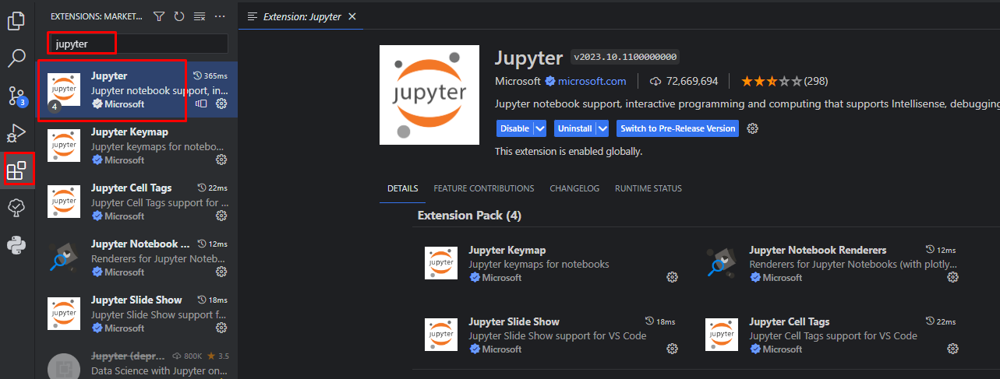
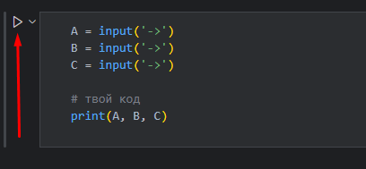

# Challenge

В этом уроке тебя ждет увлекательная практика на время. Проверь себя и свои результаты. И главное - фокус внимания наш основной ресурс, помнишь? Попробуй во время решения использовать [pomofocus.io](https://pomofocus.io/). Давай разберем некоторые моменты и можешь приступать.

## Что такое Jupyter

Jupyter-ноутбук — интерактивная среда разработки с «живым» кодом. В ней показана визуализация работы. Если разработчик хочет посмотреть на график или формулу, он пишет нужную команду в соответствующей ячейке. Такой подход экономит время и помогает избежать ошибок.

Чаще всего jupyter-ноутбуки применяют в машинном обучении, например, при подготовке нейросетей. Еще их используют специалисты по data science и начинающие программисты на Python.

## Установка плагина

Для того, чтобы запустить Jupyter прямо внутри **VS Code**, нужно установить плагин. Переходим в **расширения**, находим и устанавливаем **Jupyter**

## Как отлаживать код

Кнопка запуска программы находится слева от вашего блока с кодом. После нажатия все **input()** функции появляются ввреху по-центру экрана. При этом результат работы кода отображается снизу под блоком кода.

##### Запуск

##### Ввод данных при рабочей функции **input()**

 

##### Результат работы кода

**P.S.:** Обрати внимание, что расширение файлов-ноутбуков (**.ipynb**) отличается от обычных python-модулей (**.py**).
